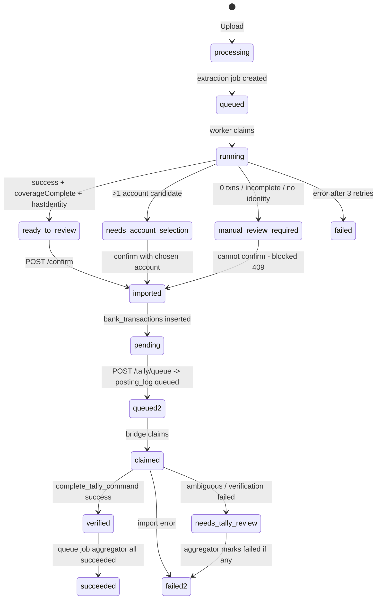
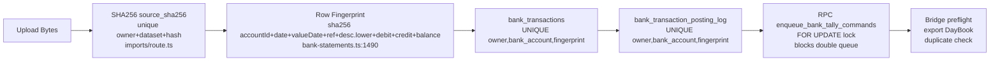
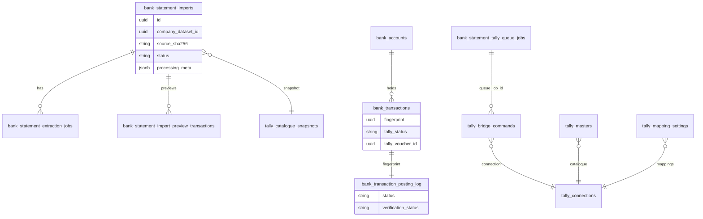

# Bank Statement -> Tally Posting — End-to-End Flow

## 1. High-Level Pipeline

```mermaid
flowchart TD
    A[User: Upload Bank Statement<br/>PDF/CSV/Image<br/>BankStatementsPage.tsx] --> B{Company Context?}
    B -->|Select Company + Tally Connection| C[Live Catalogue Fetch<br/>bank_ledgers / ledger_masters<br/>via Cash Discount Gateway WS<br/>server.mjs]
    C --> D[POST /api/bank-statements/imports<br/>imports/route.ts]
    D --> E{SHA256 Duplicate?}
    E -->|Exists & incomplete| F[Reset to Reanalysing<br/>+ requeue extraction job]
    E -->|Exists & done| G[Return Cached Preview]
    E -->|New| H[Save to Storage<br/>bank-statement-files<br/>+ catalogue snapshot<br/>tally_catalogue_snapshots]
    H --> I[Create bank_statement_imports<br/>status: processing<br/>+ bank_statement_extraction_jobs<br/>status: queued]

    I --> J[Extraction Worker<br/>process-packet-jobs.mjs<br/>poll every 5s]
    J --> K{Adaptive Extraction<br/>see detail diagram below}
    K --> L[Ledger Matching<br/>bank-statement-ledger-matching.ts<br/>AI + saved mappings]
    L --> M[Save Preview<br/>preview_transactions<br/>status: ready_to_review<br/>/ needs_account_selection<br/>/ manual_review_required]

    M --> N[User Reviews in UI<br/>GET /imports/:id<br/>edits ledgers, bill allocations]
    N --> O[POST /imports/:id/confirm<br/>confirm/route.ts]
    O --> P{Checks}
    P -->|coverageComplete != true| P1[409 BLOCKED]
    P -->|debit xor credit invalid| P2[409 BLOCKED]
    P -->|OK| Q[Create bank_accounts<br/>+ bank_transactions<br/>fingerprint dedup<br/>tally_status: pending]

    Q --> R[POST /tally/queue<br/>tally/queue/route.ts]
    R --> S{Liveness + Ledger Check}
    S -->|async=true| T[Create bank_statement_tally_queue_jobs<br/>worker batches 5]
    S -->|sync| U[Build Commands]
    U --> V{Validate}
    V -->|missing ledger / bill mismatch / same contra| V1[Skip + diagnostics]
    V -->|OK| W[RPC enqueue_bank_tally_commands<br/>tally_bridge_commands queued<br/>posting_log queued]

    W --> X[Tally Bridge<br/>bridge.mjs<br/>poll + WS wake]
    X --> Y[Claim Commands<br/>lease 30s]
    Y --> Z[Build XML<br/>buildBankVoucherXml<br/>Payment/Receipt/Contra/Journal<br/>+ BILL + BANK allocations]
    Z --> AA[POST to Tally Prime<br/>localhost:9000<br/>Import Data]
    AA --> AB[Read-back Verify<br/>by reference + amount]
    AB --> AC[POST /bridge/commands/complete<br/>RPC complete_tally_command]

    AC --> AD{Verification?}
    AD -->|verified / found| AE[bank_transactions: verified<br/>posting_log: verified]
    AD -->|needs review| AF[needs_tally_review]
    AD -->|failed| AG[failed]

    AE --> AH[Queue Job Aggregator<br/>refreshBankStatementQueueJobStatus<br/>succeeded / failed]
    AF --> AH
    AG --> AH
```

## 2. Extraction Worker — Adaptive Cascade (Detail)

```mermaid
flowchart TD
    A[Job Claimed<br/>claim_bank_statement_extraction_job<br/>FOR UPDATE SKIP LOCKED<br/>heartbeat 30s] --> B[Load Import + Download Bytes<br/>from Storage]
    B --> C[Load Catalogue<br/>tally_catalogue_snapshots<br/>or scan tally_masters 20k]

    C --> D{AnyDoc Enabled?}
    D -->|Yes| E[parseWithAnydoc<br/>anydoc-parser.ts<br/>toMarkdown local Rust 4ms]
    E --> F{Success + has Tables?}
    F -->|Yes| G[Markdown Batches 25 rows<br/>bank-statement-markdown-batches.mjs<br/>AI extract + recoverSourceCoverage<br/>per batch]
    F -->|No / NeedsOcr| H[Fallback to Text Path]
    D -->|No| H

    H --> I[pdfjs-dist Extract Text<br/>reconstructPdfTextLines<br/>max 1000 pages]
    I --> J{Usable Text?<br/>hasUsableBankStatementText<br/>>300 chars + date+balance keywords}
    J -->|Yes & <80k chars| K[AI from Text<br/>callOpenRouterForBankStatement<br/>gemini-2.5-flash 90s timeout]
    J -->|Too large / No text| L[Render to Images<br/>pdftoppm 170 DPI<br/>or python fitz fallback]

    L --> M[Compress Images<br/>sharp resize 3200..1200<br/>quality 86..56<br/>target 8MB hard 20MB]
    M --> N{Single-Shot?<br/>shouldAttemptSingleShot<br/><36k chars & <70 rows}
    N -->|Yes| O[1 AI Call with all Images]
    N -->|No| P[Batched 1 page per AI call<br/>concurrency 4<br/>BANK_STATEMENT_BATCH_PAGE_SIZE=1]

    G --> Q[Collect Transactions<br/>+ Account from Markdown]
    K --> Q
    O --> Q
    P --> Q

    Q --> R[Physical Column Recovery<br/>bank-statement-pdf-columns.mjs<br/>PNB / Central Bank X-center<br/>reconcile debit xor credit]

    R --> S[Account Extraction<br/>bank-statement-account.mjs<br/>| header | value | parse]

    S --> T[Running Balance Check<br/>bank-statement-running-balance.mjs<br/>validateRunningBalanceContinuity<br/>correctRowsFromRunningBalance]

    T --> U{Balance Valid?}
    U -->|Fail at row N| V[diagnostics.unresolvedPages<br/>coverageComplete=false<br/>extractionError]
    U -->|Pass| W[Ledger Matching<br/>suggestBankLedgersForTransactions<br/>saved mappings first<br/>then AI batch 10 concurrency 4]

    V --> X
    W --> X[Decide Final Status<br/>manual_review_required if 0 txns<br/>or incomplete or !hasIdentity<br/>needs_account_selection if >1 candidate<br/>else ready_to_review]

    X --> Y[Persist<br/>delete+insert preview_transactions<br/>update imports + diagnostics<br/>processing_meta]
    Y --> Z[Mark Job Succeeded<br/>or Retry up to 3 attempts<br/>next_run_at backoff]
```

## 3. Status Transitions



## 4. Deduplication Layers



## 5. DB Tables Involved


